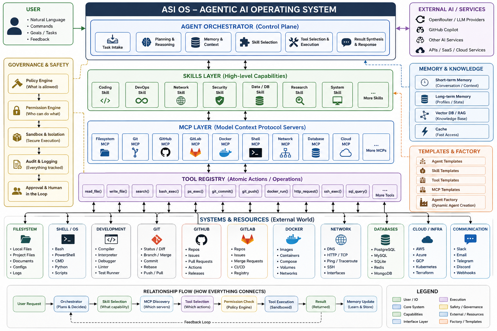

# ASI OS Foundation

A template-driven agentic operating layer for building AI agents that can reason over tasks and safely access files, code, shells, Git, GitHub, GitLab, Docker, networks, databases, cloud infrastructure, browsers, and other system resources through Skills, Tools, MCP servers, and policy-controlled execution.

> **Architecture principle:** LLM = Brain · Agent Runtime = Nervous System · Skills = Expertise · Tools = Hands · MCP = Universal Interface · Memory = Long-term Knowledge · Policy = Authority/Safety · Agent Factory = Dynamic Agent Creation

## Architecture

See [ARCHITECTURE.md](ARCHITECTURE.md) for the detailed system model and [docs/RELATIONSHIPS.md](docs/RELATIONSHIPS.md) for the relationship map.

## Core Layers

1. **User / Intent** — natural-language goals, commands, approvals and feedback.
2. **Agent Orchestrator** — planning, reasoning, context assembly, skill selection, tool selection, execution and result synthesis.
3. **Memory & Knowledge** — short-term context, long-term state, vector/RAG knowledge and cache.
4. **Skills** — reusable high-level capabilities such as coding, DevOps, networking, security, research and database operations.
5. **MCP Layer** — standardized interfaces to filesystem, Git, GitHub, GitLab, Docker, shell, network, databases, cloud and other services.
6. **Tool Registry** — atomic, schema-defined operations such as `read_file()`, `bash_exec()`, `git_diff()`, `docker_run()` and `http_request()`.
7. **Policy & Security** — permissions, sandboxing/isolation, secrets, approval gates, audit logs and risk controls.
8. **Systems & Resources** — the local machine, repositories, containers, networks, databases, cloud infrastructure and communication systems.
9. **Templates & Agent Factory** — composable Agent, Skill, Tool and MCP templates used to create task-specific agents.

## Example

A request such as **"Fix and deploy my Docker application"** can be decomposed into:

`User → Orchestrator → Coding/Debugging/DevOps Skills → MCP discovery → Git/Filesystem/Shell/Docker tools → Policy check → Sandboxed execution → Tests → Deployment approval → Result → Memory update`

## Repository Status

This repository is the **Foundation / architecture-first phase**. It intentionally starts with contracts, templates, security boundaries and documentation before implementing the full runtime.

## Roadmap

See [ROADMAP.md](ROADMAP.md).

## Security Model

The agent must not receive unrestricted host access by default. Tool calls pass through policy and permission checks and, where appropriate, a sandbox. Destructive actions and production changes should require explicit approval.

## License

Apache-2.0. See [LICENSE](LICENSE).
